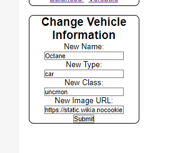
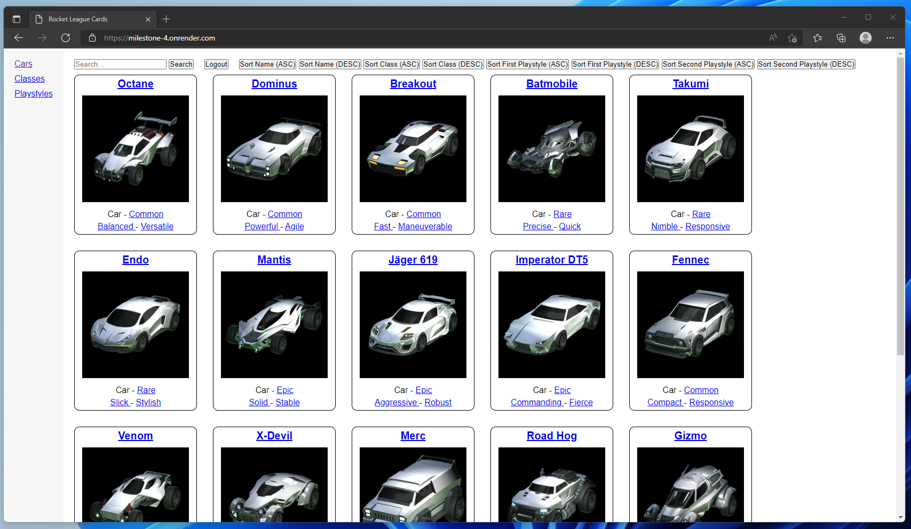
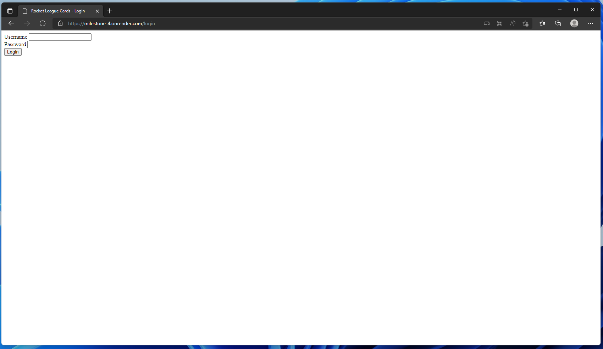

# Link to render.com
https://milestone-4.onrender.com/

# Links to related repositories
https://github.com/vstudiocode/milestone-1

https://github.com/vstudiocode/milestone-2

https://github.com/vstudiocode/milestone-3

https://github.com/vstudiocode/milestone-4

# Some information

Milestone 2:

Design wise, it doesn't look that good. I'm a backend develper.

My objective was making everything clickable and linked to eachother. Which is succeeded in :).

Feature wise, everything should work. All data is fetched from the JSON file.

 
Milestone 3: Added editing functionality as well as MongoDB.

Milestone 4:

Deployed on render.com and implemented a login system.

